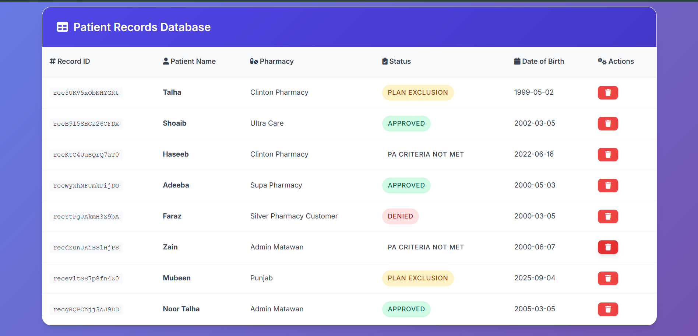
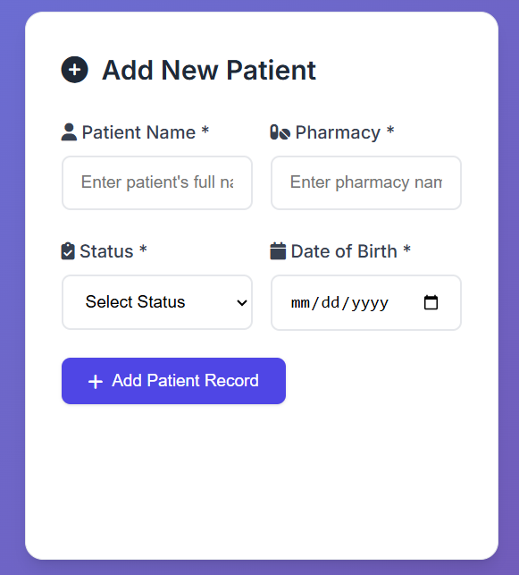
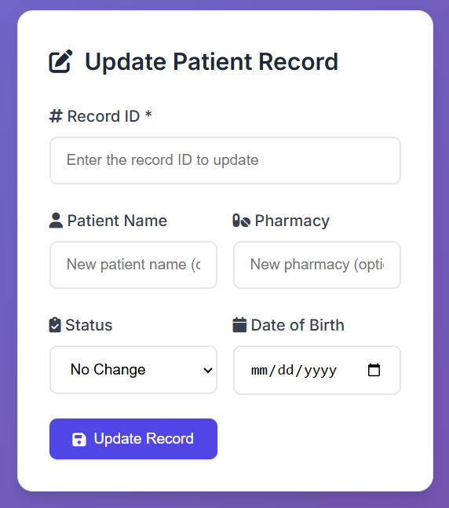
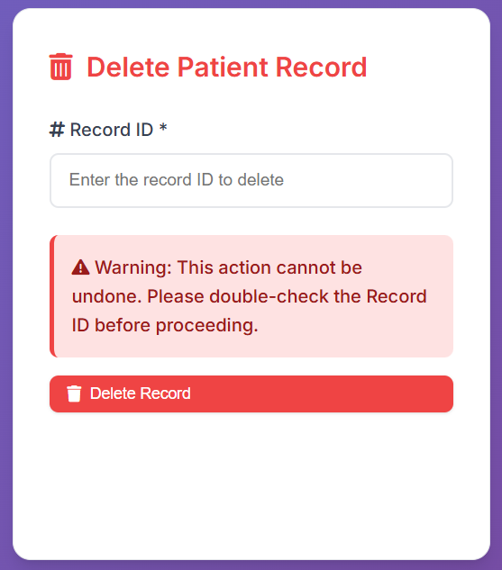

# 🏥 Flask Airtable Patient Management Dashboard

<div align="center">


**A modern, responsive web application for managing patient records with seamless Airtable integration**

[🚀 Live Demo](#demo) • [📖 Documentation](#installation) • [🛠️ Installation](#installation) • [🤝 Contributing](#contributing)

</div>

---

## 📋 Table of Contents

- [🌟 Features](#-features)
- [🎨 Screenshots](#-screenshots)
- [🚀 Quick Start](#-quick-start)
- [⚙️ Installation](#️-installation)
- [🔧 Configuration](#-configuration)
- [📚 Usage](#-usage)
- [🏗️ Project Structure](#️-project-structure)
- [🛡️ Security](#️-security)
- [🤝 Contributing](#-contributing)
- [📄 License](#-license)

---

## 🌟 Features

### ✨ **Core Functionality**
- 📊 **Complete CRUD Operations** - Create, Read, Update, Delete patient records
- 🔄 **Real-time Airtable Sync** - Seamless integration with Airtable database
- 🎨 **Modern UI/UX** - Beautiful, responsive design with Bootstrap 5
- 📱 **Mobile Responsive** - Works perfectly on all devices
- ⚡ **Fast Performance** - Optimized for speed and reliability

### 🎯 **Advanced Features**
- 🔍 **Smart Status Management** - Color-coded status indicators
- 💾 **Batch Operations** - Efficient handling of multiple records
- 🛡️ **Error Handling** - Comprehensive error management and user feedback
- 📝 **Form Validation** - Client-side and server-side validation
- 🎭 **Flash Messages** - Beautiful success and error notifications

### 🏥 **Healthcare Focused**
- 👤 **Patient Management** - Complete patient information tracking
- 🏪 **Pharmacy Integration** - Multi-pharmacy support
- 📅 **Date Management** - DOB tracking with date picker
- 📋 **Status Tracking** - Approval workflow management

---

## 🎨 Screenshots

### 📊 **Main Dashboard**

*Beautiful, modern dashboard showing all patient records with intuitive navigation*

### ➕ **Add New Patient**

*Clean, user-friendly form for adding new patient records*

### ✏️ **Update Patient Record**

*Seamless update functionality with pre-filled optional fields*

### 🗑️ **Delete Confirmation**

*Safe deletion with confirmation prompts and warnings*

---

## 🚀 Quick Start

Get your patient management system running in under 5 minutes!

```bash
# 1️⃣ Clone the repository
git clone https://github.com/Talha-Aslam/flask-airtable-patient-management.git
cd flask-airtable-patient-management

# 2️⃣ Install dependencies
pip install -r requirements.txt

# 3️⃣ Set up environment variables
cp .env.example .env
# Edit .env with your Airtable credentials

# 4️⃣ Run the application
python Main.py

# 🎉 Open http://127.0.0.1:5000 in your browser
```

---

## ⚙️ Installation

### 📋 **Prerequisites**

-  Python 3.8 or higher
-  Airtable account with API access
-  Git (for cloning)

### 🔧 **Step-by-Step Setup**

#### 1️⃣ **Clone & Navigate**
```bash
git clone https://github.com/Talha-Aslam/flask-airtable-patient-management.git
cd flask-airtable-patient-management
```

#### 2️⃣ **Create Virtual Environment** (Recommended)
```bash
# Windows
python -m venv venv
venv\Scripts\activate

# macOS/Linux
python3 -m venv venv
source venv/bin/activate
```

#### 3️⃣ **Install Dependencies**
```bash
pip install -r requirements.txt
```

#### 4️⃣ **Environment Configuration**
Create a `.env` file in the root directory:

```env
AIRTABLE_ACCESS_TOKEN=your_personal_access_token_here
AIRTABLE_BASE_ID=your_base_id_here
AIRTABLE_TABLE_NAME=your_table_name_here
```

#### 5️⃣ **Run Application**
```bash
python Main.py
```

🎉 **Success!** Visit `http://127.0.0.1:5000` to see your dashboard!

---

## 🔧 Configuration

### 🗄️ **Airtable Setup**

1. **Create Airtable Base**
   - Go to [Airtable](https://airtable.com)
   - Create a new base or use existing one

2. **Set Up Table Structure**
   ```
   Table Name: Data (or your preferred name)
   Fields:
   - Patient Name (Single line text)
   - Pharmacy (Single line text)  
   - Status (Single select: Plan Exclusion, Approved, Denied, PA Criteria Not Met)
   - DOB (Date)
   ```

3. **Get API Credentials**
   - Go to [Airtable Account](https://airtable.com/account)
   - Generate Personal Access Token
   - Copy Base ID from your base URL
   - Copy Table Name

4. **Configure Application**
   - Update `.env` file with your credentials
   - Restart the application

---

## 📚 Usage

### 🏠 **Main Dashboard**
- View all patient records in a beautiful table format
- Color-coded status indicators for quick visual reference
- One-click delete buttons with confirmation prompts

### ➕ **Adding New Patients**
```python
# All fields are required
- Patient Name: Full name of the patient
- Pharmacy: Associated pharmacy name
- Status: Select from dropdown (Plan Exclusion, Approved, Denied, PA Criteria Not Met)
- Date of Birth: Use the date picker for accurate entry
```

### ✏️ **Updating Records**
```python
# Only Record ID is required, other fields are optional
- Record ID: Airtable record identifier (shown in table)
- Patient Name: New name (optional)
- Pharmacy: New pharmacy (optional)
- Status: New status (optional)
- DOB: New date of birth (optional)
```

### 🗑️ **Deleting Records**
- **Table Row Deletion**: Click red delete button next to any record
- **Form Deletion**: Use the dedicated delete form with Record ID
- **Safety Features**: Confirmation prompts prevent accidental deletions

---

## 🏗️ Project Structure

```
flask-airtable-patient-management/
│
├── 📄 Main.py                 # Main Flask application
├── ⚙️ config.py              # Configuration management
├── 🔐 .env                   # Environment variables (create this)
├── 📋 requirements.txt       # Python dependencies
├── 📖 README.md              # This file
│
├── 📁 templates/
│   └── 🎨 table.html         # Main dashboard template
│
├── 📁 static/ (optional)
│   ├── 🎨 css/
│   ├── 📜 js/
│   └── 🖼️ images/
│
└── 📁 screenshots/
    ├── dashboard-main.png
    ├── add-patient.png
    ├── update-patient.png
    └── delete-patient.png
```

### 🔍 **Key Files Explained**

| File | Purpose | Description |
|------|---------|-------------|
| `Main.py` | 🚀 Core Application | Flask routes, CRUD operations, error handling |
| `config.py` | ⚙️ Configuration | Environment variables and settings management |
| `table.html` | 🎨 UI Template | Modern, responsive dashboard interface |
| `.env` | 🔐 Secrets | Airtable API credentials (not in repo) |

---

## 🛡️ Security

### 🔐 **Best Practices Implemented**
- ✅ Environment variables for sensitive data
- ✅ Input validation and sanitization
- ✅ Error handling without data exposure
- ✅ CSRF protection with Flask forms
- ✅ Secure session management

### 🚨 **Security Recommendations**
- 🔑 Rotate API tokens regularly
- 🌐 Use HTTPS in production
- 🛡️ Implement rate limiting
- 📝 Monitor API usage logs
- 🔒 Restrict Airtable base permissions

---

## 📦 Dependencies

| Package | Version | Purpose |
|---------|---------|---------|
|  | 2.0+ | Web framework |
|  | 1.0+ | Airtable API client |
|  | 0.19+ | Environment management |

```bash
# Install all at once
pip install flask pyairtable python-dotenv
```

---

## 🤝 Contributing

We welcome contributions! Here's how you can help:

### 🌟 **Ways to Contribute**
- 🐛 Report bugs
- 💡 Suggest new features
- 📝 Improve documentation
- 🔧 Submit pull requests
- ⭐ Star the repository

### 🔄 **Development Workflow**
1. **Fork** the repository
2. **Create** a feature branch (`git checkout -b feature/amazing-feature`)
3. **Commit** your changes (`git commit -m 'Add amazing feature'`)
4. **Push** to the branch (`git push origin feature/amazing-feature`)
5. **Open** a Pull Request

### 📋 **Development Guidelines**
- Follow PEP 8 style guidelines
- Add comments for complex logic
- Update tests for new features
- Update documentation as needed

---

## 🐛 Troubleshooting

### ❌ **Common Issues**

#### 403 Forbidden Error
```bash
# Check your Airtable permissions
- Verify API token has base access
- Confirm base ID is correct
- Ensure table name matches exactly
```

#### Module Not Found
```bash
# Install missing dependencies
pip install -r requirements.txt
```

#### Template Not Found
```bash
# Ensure correct directory structure
templates/table.html should exist
```

### 💡 **Need Help?**
- 📖 Check the [documentation](#-usage)
- 🐛 [Open an issue](https://github.com/Talha-Aslam/flask-airtable-patient-management/issues)
- 💬 [Start a discussion](https://github.com/Talha-Aslam/flask-airtable-patient-management/discussions)

---

## 📈 Roadmap

### 🔮 **Planned Features**
- [ ] 🔍 Advanced search and filtering
- [ ] 📊 Analytics dashboard
- [ ] 📧 Email notifications
- [ ] 👥 Multi-user support
- [ ] 🌐 API endpoints
- [ ] 📱 Mobile app
- [ ] 🔄 Backup automation

### 🎯 **Version 2.0 Goals**
- Enhanced UI/UX improvements
- Advanced reporting features
- Integration with other healthcare systems
- Real-time notifications
- Audit trail functionality

---

## 📄 License

This project is licensed under the MIT License - see the [LICENSE](LICENSE) file for details.

```
MIT License - Feel free to use this project for personal or commercial use!
```

---

## 👨‍💻 Author

**Talha Aslam**
- 🌟 GitHub: [@Talha-Aslam](https://github.com/Talha-Aslam)
- 📧 Email: [your-email@example.com]
- 💼 LinkedIn: [Your LinkedIn Profile]

---

## 🙏 Acknowledgments

- 🎨 **Bootstrap Team** - For the amazing UI framework
- 🗄️ **Airtable** - For the powerful database platform
- 🐍 **Flask Community** - For the excellent web framework
- ❤️ **Open Source Community** - For continuous inspiration

---

<div align="center">

### ⭐ **Star this repository if it helped you!**

**Made with ❤️ by [Talha Aslam](https://github.com/Talha-Aslam)**

---

*🔄 Last updated: September 2025*

</div>

---

## 📞 Support

If you encounter any issues or have questions:

1. 📖 **Check Documentation** - Most answers are here
2. 🔍 **Search Issues** - Someone might have had the same problem
3. 🐛 **Create New Issue** - We're here to help!
4. 💬 **Join Discussion** - Connect with the community

**Response Time**: We aim to respond within 24-48 hours.

---

*Thank you for using Flask Airtable Patient Management Dashboard! 🚀*